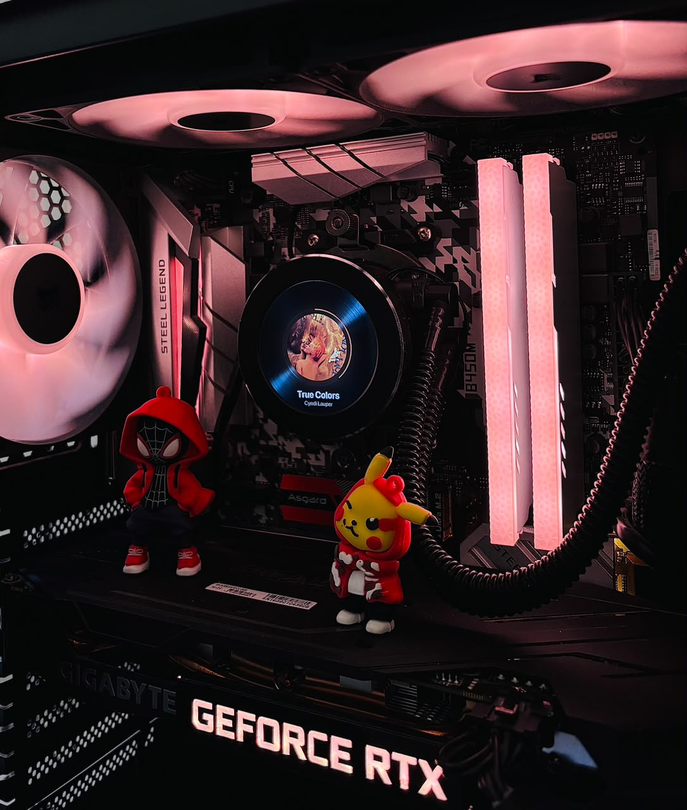

<h1 align="center">🎵 Turing Vinyl - Spotify-powered </h1>

<p align="center"><a href="README.pt-BR.md">Português</a> · <a href="README.md">English</a></p>

<p align="center">
  A music display for the Turing Smart Screen, with Spotify album art, playlist animations, vinyl transitions, and OpenRGB lighting.
</p>

<p align="center">
  <a href="https://github.com/pvict/TuringScreen-SpotifyVinyl/stargazers"></a>
  <a href="https://github.com/pvict/TuringScreen-SpotifyVinyl/network/members"></a>
  
  
  
  
</p>

<p align="center">
  <a href="#-features">Features</a> ·
  <a href="#-installation">Installation</a> ·
  <a href="#-configuration">Configuration</a> ·
  <a href="#-running-the-project">Running the project</a> ·
  <a href="#-troubleshooting">Troubleshooting</a>
</p>

---

## :sparkles: About

**Turing Vinyl** turns a USB Turing Smart Screen into an animated music display. It follows Windows playback, shows album art and track progress, highlights the current playlist, and pairs the experience with LEDs controlled through OpenRGB.

> This is an evolving personal project built for a specific hardware setup. USB communication, OpenRGB, and Spotify integration depend on the equipment, drivers, and installed software versions.

### Related project and compatibility

[turing-smart-screen-python](https://github.com/mathoudebine/turing-smart-screen-python) is a popular, broader system-monitoring project and Python library for several small USB-C displays, including Turing Smart Screen models. Turing Vinyl has a different focus: a music-driven display experience. Its compatibility is validated separately, so support in one project does not guarantee support in the other.

This repository uses the separate [Turing Smart Screen CLI](https://github.com/phstudy/turing-smart-screen-cli) by Study Hsueh for screen communication. Its MIT license is included in `turing-smart-screen-cli-main/LICENSE`. Turing Vinyl is an unofficial community project and is not affiliated with Turing, XuanFang, or their manufacturers.

## :camera: Project in action

<p align="center">
  
</p>

<p align="center"><em>The screen shows the current track while the computer lighting follows the experience.</em></p>

<p align="center"><strong>▶ Full project demo (24 seconds)</strong></p>

https://github.com/user-attachments/assets/f876053e-42a8-4e0f-b7f9-6a048da14437

### What happens in the demo

1. Pausing the music slows the vinyl down.
2. The background video changes with a smooth RGB transition.
3. Resuming playback speeds the vinyl back up.
4. A playlist animation shows which playlist the track belongs to.

## :star2: Features

- Animations streamed to the display at a target of **60 frames per second**.
- Album art, track information, and a music progress arc.
- Animated transitions between tracks and album covers.
- Vinyl rotation slows down on pause and accelerates when playback resumes.
- A smooth RGB transition accompanies the change to the paused background video.
- Playlist name and cover when the playlist changes, with periodic displays during playback.
- An animation introduces the playlist currently playing.
- Video backgrounds for playback and paused/idle states.
- Screen brightness adjusted according to the schedule configured in the script.
- LEDs synchronized with album-cover colors; while idle, the selected OpenRGB profile is used.
- Runtime information recorded in `tela.log`.

## :hammer_and_wrench: How it works

| File | Responsibility |
| --- | --- |
| `tela_completa.py` | Coordinates the display, Windows media, volume, Spotify, and OpenRGB. This is the entry point. |
| `ao_vivo.py` | Composes the visuals and encodes the live H.264 stream with FFmpeg. |
| `animacao_capa.py` | Controls album-cover transitions. |
| `spotify_playlist.py` | Retrieves playback context and playlist data through the Spotify API. |
| `leds_openrgb.py` | Controls the selected RGB zones and applies album colors or the idle profile. |

Spotify is queried every five seconds. When the playback context changes, the playlist name and artwork are updated; the screen shows the message and cover for a few seconds, then repeats the display periodically. The LEDs continue to follow the album-cover color.

## :computer: Requirements

- Windows 10 or 11.
- A USB Turing Smart Screen compatible with the protocol used by this project.
- Python 3.9 or later (Python 3.11 is a suitable starting point).
- FFmpeg on `PATH`, with support for NVIDIA's `h264_nvenc` encoder.
- An NVENC-compatible NVIDIA GPU and an installed driver.
- OpenRGB installed and configured to control the motherboard/controller.
- A Spotify account and an app created in the [Spotify Developer Dashboard](https://developer.spotify.com/dashboard).
- The background video files expected by the script.

> **About 60 FPS:** this is the stream's target, not a guarantee that every frame will reach the display. Results depend on the computer, FFmpeg/NVENC, the USB connection, and the display itself.

## :electric_plug: Installation

Open PowerShell in the project folder and create a virtual environment:

```powershell
py -3.11 -m venv .venv
.\.venv\Scripts\Activate.ps1
python -m pip install --upgrade pip
```

Install the application dependencies:

```powershell
python -m pip install Pillow pyusb pycryptodome libusb-package openrgb-python pycaw comtypes winrt-runtime winrt-Windows.Foundation winrt-Windows.Foundation.Collections winrt-Windows.Media.Control winrt-Windows.Storage.Streams
python -m pip install -e .\turing-smart-screen-cli-main
```

Install FFmpeg separately and check that PowerShell can find it:

```powershell
ffmpeg -encoders | Select-String h264_nvenc
```

If `h264_nvenc` does not appear, install an FFmpeg build with NVENC support and check your GPU driver.

## :gear: Configuration

### Spotify

1. Create an app in the [Spotify Developer Dashboard](https://developer.spotify.com/dashboard).
2. Add this redirect address in the app settings:

   ```text
   http://127.0.0.1:8765/callback
   ```

3. Create `spotify_client_id.txt` in the project folder and put only the **Client ID** on one line.
4. On the first run, authorize the app in the browser window that opens.

The project uses OAuth PKCE, so it does not need a Client Secret. The authorization token is stored locally and protected by Windows at `%LOCALAPPDATA%\TuringScreen\spotify_token.bin`.

### OpenRGB

1. Open OpenRGB and enable its SDK server at `127.0.0.1:6742`.
2. If needed to detect or control the motherboard, run OpenRGB as administrator.
3. Save an idle profile named `purple rain` in OpenRGB.
4. In `leds_openrgb.py`, check the `DISPOSITIVOS` and `ZONAS` settings. The defaults look for an ASRock device and the Addressable Header, PCH, and IO Cover zones.

The project stores a copy of the profile colors in `perfil_ocioso.json`. To reload the profile, delete this file before running the script or adjust `RELER_PERFIL` in `leds_openrgb.py`. Do not let another program control the same RGB zones at the same time.

### Videos

Keep these files next to `tela_completa.py`:

| File | When it appears |
| --- | --- |
| `video_tela.mp4` | During playback |
| `video_fundo.mp4` | While paused or idle |

The converters produce 480 × 480 square videos at 30 FPS:

- `converter.bat` creates `video_tela.mp4` from `entrada.mp4`. The source filename is currently fixed in the batch file; place the video under that name in the project folder.
- `converter_fundo.bat` asks for the source video path and creates `video_fundo.mp4`.

The `.h264` files in the repository are kept alongside the video assets. Do not remove or ignore them without first confirming that the current workflow does not depend on them.

## :rocket: Running the project

With the display connected, the virtual environment activated, and the OpenRGB SDK server available, run:

```powershell
python tela_completa.py
```

To stop, press `Ctrl+C` in the terminal. The `tela.log` file records startup information, connections, and FFmpeg messages.

## :art: Customization

The main options are near the top of the scripts:

- `tela_completa.py`: target FPS, dimensions, video files, brightness, and display elements.
- `leds_openrgb.py`: device, zones, idle profile, saturation, and delay between writes.
- `animacao_capa.py`: transition style and duration.
- `spotify_playlist.py`: polling interval and OAuth integration.

Make a backup before changing performance or RGB-write settings. The controller may behave differently depending on the motherboard, firmware, and number of zones.

## :ambulance: Troubleshooting

| Problem | What to check |
| --- | --- |
| The display is not found | USB cable, power, driver, model compatibility, and other programs using the device. |
| FFmpeg is not found | FFmpeg installation and its `bin` folder on `PATH`; open a new terminal after changing `PATH`. |
| `h264_nvenc` is missing | An FFmpeg build with NVENC support and the NVIDIA driver. |
| The playlist does not appear | Client ID, Redirect URI, internet connection, and browser authorization. To authorize again, remove the local token. |
| OpenRGB will not connect | SDK server running at `127.0.0.1:6742` and no other process controlling the same zones. |
| LEDs show incorrect colors | Stop the script, close other RGB controllers, restore the profile in OpenRGB, and check `tela.log`. |
| Video stutters | Check GPU/CPU usage, NVENC support, and other video-encoding programs; the USB connection and display also matter. |

## :lock: Privacy and credentials

- Do not publish `spotify_client_id.txt`, tokens, logs, or personal data.
- Do not add a Client Secret to the code: the integration uses PKCE and does not need one.
- The integration queries the Spotify API for playback and playlist information.
- OpenRGB is accessed locally through its SDK server at `127.0.0.1`.

## :handshake: Contributions

Suggestions and bug reports are welcome. When opening an issue, include the steps to reproduce the problem and, when useful, a relevant excerpt from `tela.log`—remove personal information or credentials first.

To propose a change:

1. Fork the project and create a branch for your change.
2. Make small, descriptive commits.
3. Open a pull request explaining what changed and how it was verified.

## :scroll: License and credits

This repository does not yet declare a license for its own scripts and media. Until a license is added, do not assume they may be reused or redistributed. The code in `turing-smart-screen-cli-main` has its own license; see `turing-smart-screen-cli-main/LICENSE`. Also check the rights for the included fonts, videos, images, and artwork.

The Spotify integration must follow the [Spotify Platform Terms](https://developer.spotify.com/terms) and [Design Guidelines](https://developer.spotify.com/documentation/design). Album art and the presentation of music content may be subject to restrictions; check the current rules before distributing the project.

<p align="center">
  Made with 💜 by <a href="https://github.com/pvict">Paulo</a>
</p>
